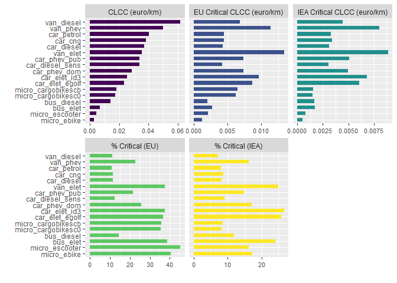
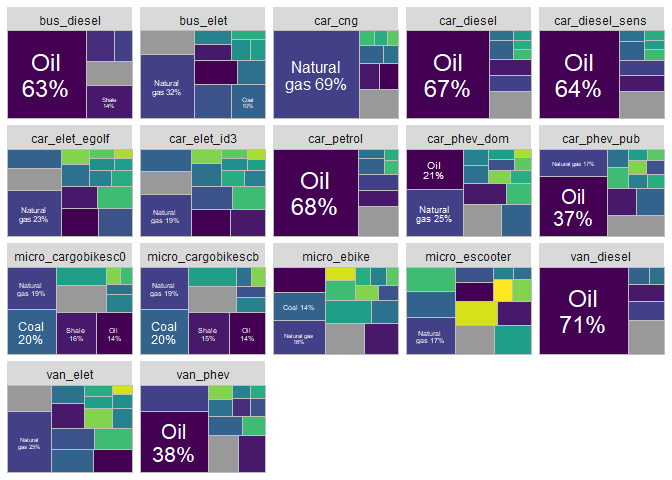

<!-- README.md is generated from README.Rmd. Please edit that file -->

# clccr

<!-- badges: start -->

<!-- badges: end -->

The clccr package provides a set of functions to compute the commodity
life cycle costing (or CLCC) indicator, a measure of resource use by a
product/process during its life cycle. The indicator can be thought as a
life cycle costing (LCC) indicator developed like it were and life cycle
assessment (LCA) indicator: costs are treated like characterization
factors, while the classification ad characterization phases are carried
out like a conventional Life Cycle Impact Assessment (LCIA). Unlike
conventional LCC - which takes into account all costs related to the
life cycle of a product - the proposed indicator only considers costs
related to natural resource use.

## Installation

You can install the development version of clccr like so:

``` r
devtools::install_github("giuliomela/clccr")
```

## Examples

These are basic examples which show you how to use the `clccr` package
to compute the CLCC indicator. The baseline indicator is calculated with
the function `clcc`. The function returns a list of two elements. The
first, `table`, is a tibble with the calculation result, while the
second, `plot`, is a `ggplot` plot object representing the results. The
`table` element contains both the baseline and the critical CLCC
indicators.

``` r
library(clccr)

# computing the CLCC indicator for three example inventories (cars)

res <- clcc(data_path = path_to_folder
            #path_weights = path_to_weights
            )

res[["table"]]
#> # A tibble: 102 × 7
#>    object    phase    clcc clcc_critical_eu clcc_critical_iea share_critical_iea
#>    <chr>     <chr>   <dbl>            <dbl>             <dbl>              <dbl>
#>  1 bus_dies… batt… 0              0                 0                      0    
#>  2 bus_dies… manu… 3.93e-4        0.0000541         0.0000735             18.7  
#>  3 bus_dies… total 1.40e-2        0.00204           0.00166               11.9  
#>  4 bus_dies… uso   0              0                 0                      0    
#>  5 bus_dies… veic… 4.06e-3        0.00180           0.00152               37.3  
#>  6 bus_dies… vett… 9.57e-3        0.000179          0.0000719              0.752
#>  7 bus_elet  batt… 2.75e-3        0.00186           0.00128               46.6  
#>  8 bus_elet  manu… 3.26e-4        0.0000414         0.0000343             10.5  
#>  9 bus_elet  total 7.10e-3        0.00275           0.00171               24.1  
#> 10 bus_elet  uso   0              0                 0                      0    
#> # ℹ 92 more rows
#> # ℹ 1 more variable: share_critical_eu <dbl>
```

The default plot looks like:

``` r

res[["plot"]]
```



Even though data on reference prices cannot be updated programmatically
since not all source have an API, it is possible to extract a tibble
with reference prices and minimum and maximum values (used in Monte
Carlo simulations) of the last 10-year period. The user can get
information on price levels and data sources in the
`clccr::clcc_prices_ref` tibble with data sources.

``` r

# A tibble with information on prices used and data sources
prices <- clcc_prices_ref

head(prices, 5)
#> # A tibble: 5 × 13
#>   comm      no_comm um    source  critical_eu critical_iea macro_cat code   mean
#>   <chr>       <dbl> <chr> <chr>   <chr>       <chr>        <chr>     <chr> <dbl>
#> 1 Acids           1 kg    none    no          no           Chemical… <NA>     0 
#> 2 Actinium        2 kg    comtra… no          no           Actinium  2844…  218.
#> 3 Additives       3 kg    none    no          no           Chemical… <NA>     0 
#> 4 Air             4 kg    none    no          no           Gases, o… <NA>     0 
#> 5 Alloys          5 kg    none    no          no           Other     <NA>     0 
#> # ℹ 4 more variables: min <dbl>, max <dbl>, n_obs <int>, ref_yr <dbl>
```

The `clcc` function returns the total CLCC indicator (computed taking
into account all material and energy flows) but the user might be
interested in having information on the relative importance of each flow
on total baseline or critical CLCC. The `clcc_detail` function fills
this gap. It returns a list containing a tibble with the relative share
of each material or energy flow on the CLCC indicator (`table`) and a
`ggplot` object (`plot`). Such shares can be computed for either the
baseline and critical CLCC indicators (setting the `detail` parameter to
either `TRUE` or `FALSE`) as well as for the entire life-cycle or just
one of the life-cycle phases.

``` r

detail_info <- clcc_detail(data_path = path_to_folder,
                           #weights_path = path_to_weights,
                           critical = FALSE,
                           phase_of_int = "total",
                           collapse_share = 0.9)
#> Joining with `by = join_by(comm, um, no_comm)`
#> Joining with `by = join_by(object, phase, clcc_type)`

head(detail_info[["table"]], 10)
#> # A tibble: 10 × 6
#>    object     macro_cat   phase clcc_type         clcc  share
#>    <chr>      <chr>       <chr> <chr>            <dbl>  <dbl>
#>  1 bus_diesel Oil         total baseline-clcc 0.00885  0.631 
#>  2 bus_diesel Shale       total baseline-clcc 0.00195  0.139 
#>  3 bus_diesel Other       total baseline-clcc 0.00140  0.100 
#>  4 bus_diesel PGMs        total baseline-clcc 0.00111  0.0792
#>  5 bus_diesel Natural gas total baseline-clcc 0.000709 0.0506
#>  6 bus_elet   Natural gas total baseline-clcc 0.00226  0.318 
#>  7 bus_elet   Other       total baseline-clcc 0.000837 0.118 
#>  8 bus_elet   Lithium     total baseline-clcc 0.000801 0.113 
#>  9 bus_elet   Coal        total baseline-clcc 0.000735 0.104 
#> 10 bus_elet   Oil         total baseline-clcc 0.000674 0.0949
```

Also in this case the function returns a default plot of the results.

``` r

detail_info[["plot"]]
```



The package provides two alternative versions of the CLCC indicator,
taking into account critical materials only. The first alternative uses
the latest version of the European Union list of critical materials,
while the second the latest version of the list provided by the
International Energy Agency. The critical-CLCC indicator can only
capture and economically quantify the elementary flow `Coal, hard`,
which encompasses coking coal (a critical material according to the EU
list), which is used in steel production. However, this flow is not
exclusively associated with steel production; it is also used in other
processes, such as electricity generation. This leads to a significant
overestimation of the commodity cost because the current methodology
assumes elementary flows, whereas in this case the flow represents a
semi-finished product. A similar issue occurs with metallurgical-grade
silicon, which in Ecoinvent can only be represented through the
elementary flows Sand and Gravel. In the case of coking coal, to
mitigate the bias, the LCA practitioners must compute the total quantity
(in kilograms) of the `Coal, hard` flow for the entire system under
analysis and then identify the quantity of `Coal, hard` associated with
the process: `Coke {GLO} | market for coke | Cut-off, U`. The ratio
between these two quantities represents the share of `Coal, hard` in the
inventory that can be considered critical. In the case of
metallurgical-grade silicon, the practitioner must identify the
contribution of the process
`Silicon, metallurgical grade {GLO} | market for silicon, metallurgical grade | Cut-off, U`.
This quantity represents the critical silicon flow. These additional
data for coal and silicon must be provided in `.xlsx` format. The
spreadsheet must contain two sheets (named “coke” and “silicon”) each
with four columns containing: the name of the object (must be the same
used to name the inventories), the name of the substance, the name of
the phase (the same used in the inventories) and the value. In the case
of coke the value is a weight, while in the case of silicon it is a
quantity.

``` r

res_weights <- 
  clcc(
    data_path = path_to_folder,
    use_weights = TRUE,
    weights_path = path_to_weights
  )
#> Joining with `by = join_by(object, comm, phase)`

res_weights[["table"]]
#> # A tibble: 102 × 7
#>    object    phase    clcc clcc_critical_eu clcc_critical_iea share_critical_iea
#>    <chr>     <chr>   <dbl>            <dbl>             <dbl>              <dbl>
#>  1 bus_dies… batt… 0              0                 0                      0    
#>  2 bus_dies… manu… 3.93e-4        0.0000293         0.0000737             18.8  
#>  3 bus_dies… total 1.40e-2        0.00175           0.00167               11.9  
#>  4 bus_dies… uso   0              0                 0                      0    
#>  5 bus_dies… veic… 4.07e-3        0.00161           0.00152               37.4  
#>  6 bus_dies… vett… 9.57e-3        0.000120          0.0000720              0.752
#>  7 bus_elet  batt… 2.75e-3        0.00161           0.00128               46.6  
#>  8 bus_elet  manu… 3.26e-4        0.0000181         0.0000344             10.6  
#>  9 bus_elet  total 7.11e-3        0.00208           0.00172               24.2  
#> 10 bus_elet  uso   0              0                 0                      0    
#> # ℹ 92 more rows
#> # ℹ 1 more variable: share_critical_eu <dbl>
```

The `clccr` package also allows to run a Monte Carlo simulation, given
the high volatility that characterizes market prices. Minimum and
maximum prices are used, for each commodity, to generate random values
using triangular distributions. Function `clcc_mc` runs the simulations
and allows to pick the desired number of simulations with the `rep`
parameter (default is `rep = 10000`) and the life cycle phase to
consider (default is `"total"`). The function returns a tibble nested
tibble containing project and object names, baseline clcc, all
simulations, and the probability that the indicator is lower than the
baseline (probability computed using the empirical distribution
function). Similarly to the `clcc()`, also `clcc_mc()` returns a list: a
tibble with the results and a plot displaying the simulation results.
Please refer to the `clcc_mc()` documentation to see which are the
plotting alternatives available.

``` r

# Monte Carlo simulation

rep <- 1000 # number of simulations (default is 10,000)
phase <- "total" # the life cycle phase for which running the simulation

mc_res <- clcc_mc(data_path = path_to_folder, 
                  #weights_path = path_to_weights,
                  rep = rep)
#> Joining with `by = join_by(comm, um, no_comm)`
#> Joining with `by = join_by(object, phase)`

mc_res[["table"]]
#> # A tibble: 17 × 10
#>    object      phase clcc_sim ecdf_fn    clcc clcc_critical_eu clcc_critical_iea
#>    <chr>       <chr> <list>   <list>    <dbl>            <dbl>             <dbl>
#>  1 bus_diesel  total <dbl>    <ecdf>  0.0140           0.00204          0.00166 
#>  2 bus_elet    total <dbl>    <ecdf>  0.00710          0.00275          0.00171 
#>  3 car_cng     total <dbl>    <ecdf>  0.0382           0.00447          0.00338 
#>  4 car_diesel  total <dbl>    <ecdf>  0.0371           0.00428          0.00310 
#>  5 car_diesel… total <dbl>    <ecdf>  0.0337           0.00422          0.00307 
#>  6 car_elet_e… total <dbl>    <ecdf>  0.0235           0.00864          0.00608 
#>  7 car_elet_i… total <dbl>    <ecdf>  0.0256           0.00960          0.00682 
#>  8 car_petrol  total <dbl>    <ecdf>  0.0402           0.00444          0.00328 
#>  9 car_phev_d… total <dbl>    <ecdf>  0.0288           0.00738          0.00494 
#> 10 car_phev_p… total <dbl>    <ecdf>  0.0339           0.00734          0.00506 
#> 11 micro_carg… total <dbl>    <ecdf>  0.0175           0.00622          0.00146 
#> 12 micro_carg… total <dbl>    <ecdf>  0.0182           0.00653          0.00156 
#> 13 micro_ebike total <dbl>    <ecdf>  0.00306          0.00124          0.000529
#> 14 micro_esco… total <dbl>    <ecdf>  0.00472          0.00213          0.000766
#> 15 van_diesel  total <dbl>    <ecdf>  0.0614           0.00687          0.00446 
#> 16 van_elet    total <dbl>    <ecdf>  0.0356           0.0133           0.00887 
#> 17 van_phev    total <dbl>    <ecdf>  0.0497           0.0114           0.00806 
#> # ℹ 3 more variables: share_critical_iea <dbl>, share_critical_eu <dbl>,
#> #   prob_inf_base <dbl>
```

Setting the argument `prob_inf_alt` to `TRUE` (default is `FALSE`),
`clcc_mc` returns a tibble with the probability that each object’s CLCC
is lower than that of every other object (also across projects, even if
it is not always appropriate). Such probabilities are computed, for each
object pair, using the empirical distribution function computed on the
differences between all the simulated values for each object.

``` r

# Monte Carlo simulation returning the probability that an object's CLCC is lower/higher than that of the
# other alternatives

mc_res2 <- clcc_mc(data_path = path_to_folder, 
                   #path_weights = path_to_weights,
                   rep = rep, prob_inf_alt = TRUE)
#> Joining with `by = join_by(comm, um, no_comm)`
#> Joining with `by = join_by(object, phase)`

mc_res2[["table"]]
#> # A tibble: 289 × 3
#>    obj1       obj2             prob
#>    <chr>      <chr>           <dbl>
#>  1 bus_diesel bus_diesel         NA
#>  2 bus_diesel bus_elet            0
#>  3 bus_diesel car_cng             1
#>  4 bus_diesel car_diesel          1
#>  5 bus_diesel car_diesel_sens     1
#>  6 bus_diesel car_elet_egolf      1
#>  7 bus_diesel car_elet_id3        1
#>  8 bus_diesel car_petrol          1
#>  9 bus_diesel car_phev_dom        1
#> 10 bus_diesel car_phev_pub        1
#> # ℹ 279 more rows
```

The package also allows the user to export reference prices for both the
baseline and critical indicators to a .csv file compatible with SimaPro,
one of the most popular LCA software. To accomplish this task the user
can call the `simapro_export()` function. Such function has no arguments
and, once called, automatically opens a pop-up windows that asks the
user where to save the file.

Finally, function `copy_xlsx_files()` allows the user to copy raw
SimaPro LCA inventories from a folder to another and, at the same time,
changing the file extension from `.XLSX` to `.xlsx` if needed.
SimaPro-generated spreadsheets often have this problem, which can
prevent the inventories from being loaded correctly by the `clcc()` or
the `clcc_mc()` functions.
