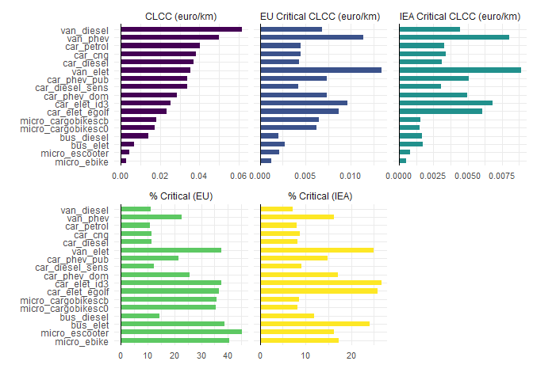

<!-- README.md is generated from README.Rmd. Please edit that file -->

# clccr

<!-- badges: start -->

<!-- badges: end -->

The clccr package provides a set of functions to compute the commodity
life cycle costing (or CLCC) indicator, a measure of resource use by a
product/process during its life cycle. The indicator can be thought as a
life cycle costing (LCC) indicator developed like it were and life cycle
assessment (LCA) indicator: costs are treated like characterization
factors, while the classification ad characterization phases are carried
out like a conventional Life Cycle Impact Assessment (LCIA). Unlike
conventional LCC - which takes into account all costs related to the
life cycle of a product - the proposed indicator only considers costs
related to natural resource use.

## Installation

You can install the development version of clccr like so:

``` r
devtools::install_github("giuliomela/clccr")
```

## Examples

These are basic examples which show you how to use the `clccr` package
to compute the CLCC indicator. The baseline indicator is calculated with
the function `clcc`. The function returns a list of two elements. The
first, `table`, is a tibble with the calculation result, while the
second, `plot`, is a `ggplot` plot object representing the results. The
`table` element contains both the baseline and the critical CLCC
indicators.

``` r
library(clccr)

# computing the CLCC indicator for three example inventories (cars)

res <- clcc(path = path_to_folder
            #path_weights = path_to_weights
            )

res[["table"]]
#> # A tibble: 102 × 5
#>    object     phase                  clcc clcc_critical share_critical
#>    <chr>      <chr>                 <dbl>         <dbl>          <dbl>
#>  1 bus_diesel Batteria           0            0                   0   
#>  2 bus_diesel Manutenzione       0.000391     0.0000505          12.9 
#>  3 bus_diesel Uso                0            0                   0   
#>  4 bus_diesel Veicolo            0.00394      0.00176            44.8 
#>  5 bus_diesel Vettore energetico 0.00986      0.000163            1.65
#>  6 bus_diesel total              0.0142       0.00198            13.9 
#>  7 bus_elet   Batteria           0.00268      0.00179            67.0 
#>  8 bus_elet   Manutenzione       0.000325     0.0000383          11.8 
#>  9 bus_elet   Uso                0            0                   0   
#> 10 bus_elet   Veicolo            0.00119      0.000504           42.4 
#> # ℹ 92 more rows
```

The default plot looks like:

``` r

res[["plot"]]
#> Warning in grid.Call(C_textBounds, as.graphicsAnnot(x$label), x$x, x$y, :
#> famiglia di caratteri non trovata nel database dei caratteri di Windows
#> Warning in grid.Call(C_textBounds, as.graphicsAnnot(x$label), x$x, x$y, :
#> famiglia di caratteri non trovata nel database dei caratteri di Windows
#> Warning in grid.Call(C_textBounds, as.graphicsAnnot(x$label), x$x, x$y, :
#> famiglia di caratteri non trovata nel database dei caratteri di Windows
#> Warning in grid.Call(C_textBounds, as.graphicsAnnot(x$label), x$x, x$y, :
#> famiglia di caratteri non trovata nel database dei caratteri di Windows
#> Warning in grid.Call(C_textBounds, as.graphicsAnnot(x$label), x$x, x$y, :
#> famiglia di caratteri non trovata nel database dei caratteri di Windows
#> Warning in grid.Call.graphics(C_text, as.graphicsAnnot(x$label), x$x, x$y, :
#> famiglia di caratteri non trovata nel database dei caratteri di Windows
#> Warning in grid.Call.graphics(C_text, as.graphicsAnnot(x$label), x$x, x$y, :
#> famiglia di caratteri non trovata nel database dei caratteri di Windows
#> Warning in grid.Call(C_textBounds, as.graphicsAnnot(x$label), x$x, x$y, :
#> famiglia di caratteri non trovata nel database dei caratteri di Windows
#> Warning in grid.Call(C_textBounds, as.graphicsAnnot(x$label), x$x, x$y, :
#> famiglia di caratteri non trovata nel database dei caratteri di Windows
#> Warning in grid.Call(C_textBounds, as.graphicsAnnot(x$label), x$x, x$y, :
#> famiglia di caratteri non trovata nel database dei caratteri di Windows
#> Warning in grid.Call(C_textBounds, as.graphicsAnnot(x$label), x$x, x$y, :
#> famiglia di caratteri non trovata nel database dei caratteri di Windows
#> Warning in grid.Call.graphics(C_text, as.graphicsAnnot(x$label), x$x, x$y, :
#> famiglia di caratteri non trovata nel database dei caratteri di Windows
#> Warning in grid.Call.graphics(C_text, as.graphicsAnnot(x$label), x$x, x$y, :
#> famiglia di caratteri non trovata nel database dei caratteri di Windows
#> Warning in grid.Call.graphics(C_text, as.graphicsAnnot(x$label), x$x, x$y, :
#> famiglia di caratteri non trovata nel database dei caratteri di Windows
#> Warning in grid.Call.graphics(C_text, as.graphicsAnnot(x$label), x$x, x$y, :
#> famiglia di caratteri non trovata nel database dei caratteri di Windows
#> Warning in grid.Call(C_textBounds, as.graphicsAnnot(x$label), x$x, x$y, :
#> famiglia di caratteri non trovata nel database dei caratteri di Windows
#> Warning in grid.Call(C_textBounds, as.graphicsAnnot(x$label), x$x, x$y, :
#> famiglia di caratteri non trovata nel database dei caratteri di Windows
#> Warning in grid.Call(C_textBounds, as.graphicsAnnot(x$label), x$x, x$y, :
#> famiglia di caratteri non trovata nel database dei caratteri di Windows
#> Warning in grid.Call(C_textBounds, as.graphicsAnnot(x$label), x$x, x$y, :
#> famiglia di caratteri non trovata nel database dei caratteri di Windows
#> Warning in grid.Call(C_textBounds, as.graphicsAnnot(x$label), x$x, x$y, :
#> famiglia di caratteri non trovata nel database dei caratteri di Windows
#> Warning in grid.Call(C_textBounds, as.graphicsAnnot(x$label), x$x, x$y, :
#> famiglia di caratteri non trovata nel database dei caratteri di Windows
#> Warning in grid.Call.graphics(C_text, as.graphicsAnnot(x$label), x$x, x$y, :
#> famiglia di caratteri non trovata nel database dei caratteri di Windows
#> Warning in grid.Call.graphics(C_text, as.graphicsAnnot(x$label), x$x, x$y, :
#> famiglia di caratteri non trovata nel database dei caratteri di Windows
#> Warning in grid.Call.graphics(C_text, as.graphicsAnnot(x$label), x$x, x$y, :
#> famiglia di caratteri non trovata nel database dei caratteri di Windows
#> Warning in grid.Call.graphics(C_text, as.graphicsAnnot(x$label), x$x, x$y, :
#> famiglia di caratteri non trovata nel database dei caratteri di Windows
```



Even though data on reference prices cannot be updated programmatically
since not all source have an API, it is possible to extract a tibble
with reference prices and minimum and maximum values (used in Monte
Carlo simulations) of the last 10-year period. The user can get
information on price levels and data sources in the
`clccr::clcc_prices_ref` tibble with data sources.

``` r

# A tibble with information on prices used and data sources
prices <- clcc_prices_ref

head(prices, 5)
#> # A tibble: 5 × 12
#>   comm   no_comm um    source critical macro_cat code   mean     min   max n_obs
#>   <chr>    <dbl> <chr> <chr>  <chr>    <chr>     <chr> <dbl>   <dbl> <dbl> <int>
#> 1 Acids        1 kg    none   no       Chemical… <NA>     0  0          0     NA
#> 2 Actin…       2 kg    comtr… no       Actinium  2844…  254. 0.00929  756.    10
#> 3 Addit…       3 kg    none   no       Chemical… <NA>     0  0          0     NA
#> 4 Air          4 kg    none   no       Gases, o… <NA>     0  0          0     NA
#> 5 Alloys       5 kg    none   no       Other     <NA>     0  0          0     NA
#> # ℹ 1 more variable: ref_yr <dbl>
```

The `clcc` function returns the total CLCC indicator (computed taking
into account all material and energy flows) but the user might be
interested in having information on the relative importance of each flow
on total baseline or critical CLCC. The `clcc_detail` function fills
this gap. It returns a list containing a tibble with the relative share
of each material or energy flow on the CLCC indicator (`table`) and a
`ggplot` object (`plot`). Such shares can be computed for either the
baseline and critical CLCC indicators (setting the `detail` parameter to
either `TRUE` or `FALSE`) as well as for the entire life-cycle or just
one of the life-cycle phases.

``` r

detail_info <- clcc_detail(path = path_to_folder,
                           #path_weights = path_to_weights,
                           critical = FALSE,
                           phase_of_int = "total",
                           collapse_share = 0.9)
#> Joining with `by = join_by(object, phase, clcc_type)`
```

``` r

head(detail_info[["table"]], 10)
#> # A tibble: 10 × 6
#>    object     macro_cat   phase clcc_type         clcc  share
#>    <chr>      <chr>       <chr> <chr>            <dbl>  <dbl>
#>  1 bus_diesel Oil         total baseline-clcc 0.00919  0.647 
#>  2 bus_diesel Other       total baseline-clcc 0.00206  0.145 
#>  3 bus_diesel Shale       total baseline-clcc 0.00185  0.130 
#>  4 bus_diesel PGMs        total baseline-clcc 0.00110  0.0776
#>  5 bus_elet   Natural gas total baseline-clcc 0.00225  0.322 
#>  6 bus_elet   Other       total baseline-clcc 0.000816 0.117 
#>  7 bus_elet   Lithium     total baseline-clcc 0.000770 0.110 
#>  8 bus_elet   Oil         total baseline-clcc 0.000700 0.100 
#>  9 bus_elet   Coal        total baseline-clcc 0.000671 0.0961
#> 10 bus_elet   Nickel      total baseline-clcc 0.000440 0.0630
```

Also in this case the function returns a default plot of the results.

``` r

detail_info[["plot"]]
```


The `clccr` package also allows to run a Monte Carlo simulation, given
the high volatility that characterizes market prices. Minimum and
maximum prices are used, for each commodity, to generate random values
using triangular distributions. Function `clcc_mc` runs the simulations
and allows to pick the desired number of simulations with the `rep`
parameter (default is `rep = 10000`) and the life cycle phase to
consider (default is `"total"`). The function returns a tibble nested
tibble containing project and object names, baseline clcc, all
simulations, and the probability that the indicator is lower than the
baseline (probability computed using the empirical distribution
function). Similarly to the `clcc()`, also `clcc_mc()` returns a list: a
tibble with the results and a plot displaying the simulation results.
Please refer to the `clcc_mc()` documentation to see which are the
plotting alternatives available.

``` r

# Monte Carlo simulation

rep <- 1000 # number of simulations (default is 10,000)
phase <- "total" # the life cycle phase for which running the simulation

mc_res <- clcc_mc(path = path_to_folder, 
                  #path_weights = path_to_weights,
                  rep = rep)
#> Joining with `by = join_by(comm, um, no_comm)`
#> Joining with `by = join_by(object, phase)`
```

``` r

mc_res[["table"]]
#> # A tibble: 17 × 8
#>    object            phase clcc_sim ecdf_fn    clcc clcc_critical share_critical
#>    <chr>             <chr> <list>   <list>    <dbl>         <dbl>          <dbl>
#>  1 bus_diesel        total <dbl>    <ecdf>  0.0142        0.00198           13.9
#>  2 bus_elet          total <dbl>    <ecdf>  0.00699       0.00263           37.7
#>  3 car_cng           total <dbl>    <ecdf>  0.0378        0.00412           10.9
#>  4 car_diesel        total <dbl>    <ecdf>  0.0376        0.00395           10.5
#>  5 car_diesel_sens   total <dbl>    <ecdf>  0.0341        0.00389           11.4
#>  6 car_elet_egolf    total <dbl>    <ecdf>  0.0229        0.00813           35.4
#>  7 car_elet_id3      total <dbl>    <ecdf>  0.0249        0.00903           36.2
#>  8 car_petrol        total <dbl>    <ecdf>  0.0408        0.00408           10.0
#>  9 car_phev_dom      total <dbl>    <ecdf>  0.0283        0.00687           24.2
#> 10 car_phev_pub      total <dbl>    <ecdf>  0.0337        0.00683           20.3
#> 11 micro_cargobikeS… total <dbl>    <ecdf>  0.0171        0.00581           34.0
#> 12 micro_cargobikeS… total <dbl>    <ecdf>  0.0177        0.00609           34.4
#> 13 micro_ebike       total <dbl>    <ecdf>  0.00299       0.00118           39.4
#> 14 micro_escooter    total <dbl>    <ecdf>  0.00459       0.00205           44.6
#> 15 van_diesel        total <dbl>    <ecdf>  0.0625        0.00642           10.3
#> 16 van_elet          total <dbl>    <ecdf>  0.0347        0.0127            36.6
#> 17 van_phev          total <dbl>    <ecdf>  0.0495        0.0108            21.8
#> # ℹ 1 more variable: prob_inf_base <dbl>
```

Setting the argument `prob_inf_alt` to `TRUE` (default is `FALSE`),
`clcc_mc` returns a tibble with the probability that each object’s CLCC
is lower than that of every other object (also across projects, even if
it is not always appropriate). Such probabilities are computed, for each
object pair, using the empirical distribution function computed on the
differences between all the simulated values for each object.

``` r

# Monte Carlo simulation returning the probability that an object's CLCC is lower/higher than that of the
# other alternatives

mc_res2 <- clcc_mc(path = path_to_folder, 
                   #path_weights = path_to_weights,
                   rep = rep, prob_inf_alt = TRUE)
#> Joining with `by = join_by(comm, um, no_comm)`
#> Joining with `by = join_by(object, phase)`
```

``` r

mc_res2[["table"]]
#> # A tibble: 289 × 3
#>    obj1       obj2             prob
#>    <chr>      <chr>           <dbl>
#>  1 bus_diesel bus_diesel         NA
#>  2 bus_diesel bus_elet            0
#>  3 bus_diesel car_cng             1
#>  4 bus_diesel car_diesel          1
#>  5 bus_diesel car_diesel_sens     1
#>  6 bus_diesel car_elet_egolf      1
#>  7 bus_diesel car_elet_id3        1
#>  8 bus_diesel car_petrol          1
#>  9 bus_diesel car_phev_dom        1
#> 10 bus_diesel car_phev_pub        1
#> # ℹ 279 more rows
```

Finally, the package allows the user to export reference prices for both
the baseline and critical indicators to a .csv file compatible with
SimaPro, one of the most popular LCA software. To accomplish this task
the user can call the `simapro_export()` function. Such function has no
arguments and, once called, automatically opens a pop-up windows that
asks the user where to save the file.
